# 🎨 CreativeHub 创意作品展示平台

> 一个专为创意工作者打造的作品展示与社区交流平台

---

## 📖 项目简介

**CreativeHub** 是一个创意作品展示与社区交流平台，旨在为数字媒体技术、视觉传达、UI设计等专业的学生和创意工作者提供一个集中展示作品、交流灵感、建立个人品牌的空间。

### 🎯 解决的问题

- **作品分散存储**：将散落在各处的设计作品集中展示
- **缺少交流渠道**：与同行互动，获取作品反馈
- **求职作品集整理**：快速整理和展示个人作品集
- **数据追踪**：了解作品的受欢迎程度和影响力

### 💡 核心价值

- 精美展示个人作品，支持多图轮播
- 社区互动：点赞、收藏、评论、关注
- 数据统计：浏览量、点赞率、互动率
- 话题广场：分享创意，交流灵感

---

## 🛠️ 技术栈

| 技术                                      | 版本  | 用途      |
| ----------------------------------------- | ----- | --------- |
| [Vue 3](https://vuejs.org/)               | 3.4.x | 前端框架  |
| [Vite](https://vitejs.dev/)               | 5.x   | 构建工具  |
| [Pinia](https://pinia.vuejs.org/)         | 2.x   | 状态管理  |
| [Vue Router](https://router.vuejs.org/)   | 4.x   | 路由管理  |
| [Element Plus](https://element-plus.org/) | 2.x   | UI 组件库 |
| [Axios](https://axios-http.com/)          | 1.x   | HTTP 请求 |
| [dayjs](https://day.js.org/)              | 1.x   | 日期处理  |
| [Mock.js](http://mockjs.com/)             | 1.x   | 数据模拟  |

---

## 📋 功能列表

### ✅ P0 级功能（核心功能）

| 功能          | 描述                             | 状态 |
| ------------- | -------------------------------- | ---- |
| 用户注册/登录 | 完整的认证系统，支持"记住我"     | ✅   |
| 作品上传      | 标题、描述、分类、标签、多图上传 | ✅   |
| 作品列表展示  | 瀑布流布局，支持排序             | ✅   |
| 作品详情页    | 大图轮播、项目说明、互动         | ✅   |
| 用户个人主页  | 用户信息、作品集展示             | ✅   |
| 点赞功能      | 点赞/取消点赞，实时计数          | ✅   |

### ✅ P1 级功能（重要功能）

| 功能          | 描述                   | 状态 |
| ------------- | ---------------------- | ---- |
| 收藏功能      | 收藏作品，我的收藏页面 | ✅   |
| 评论功能      | 发表/删除评论          | ✅   |
| 关注/粉丝系统 | 关注用户，查看粉丝     | ✅   |
| 搜索功能      | 搜索作品和用户         | ✅   |
| 分类/标签筛选 | 按分类和标签浏览作品   | ✅   |
| 创作者中心    | 作品管理、仪表盘       | ✅   |

### ✅ P2 级功能（扩展功能）

| 功能         | 描述                   | 状态 |
| ------------ | ---------------------- | ---- |
| 热门排行榜   | 作品和创作者排行       | ✅   |
| 数据统计     | 浏览量、点赞率、互动率 | ✅   |
| 草稿箱       | 未完成作品暂存         | ✅   |
| 话题广场     | 发帖、评论、点赞       | ✅   |
| 关注管理     | 我的关注/我的粉丝      | ✅   |
| 图片全屏查看 | 作品图片全屏浏览       | ✅   |

---

## 🚀 安装运行步骤

1. 克隆项目
   git clone https://github.com/jiuyue96969696/creativehub.git
   cd creativehub

2. 安装依赖

npm install

3. 启动开发服务器

npm run dev

4. 访问应用
   打开浏览器访问：http://localhost:3000

5. 构建生产版本

npm run build

6. 预览生产版本

npm run preview

## 📸 项目截图

项目截图已经全部放在images文件夹下，下面是截图对应的页面内容，为方便查看可以见课程设计报告5.2功能截图部分

#### 1. 首页 - 欢迎页面

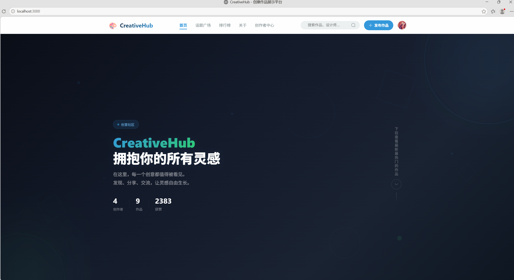

#### 2. 首页 - 作品列表

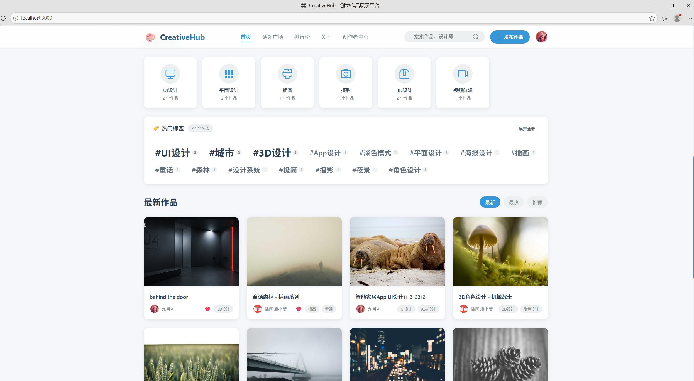

#### 3. 作品详情页

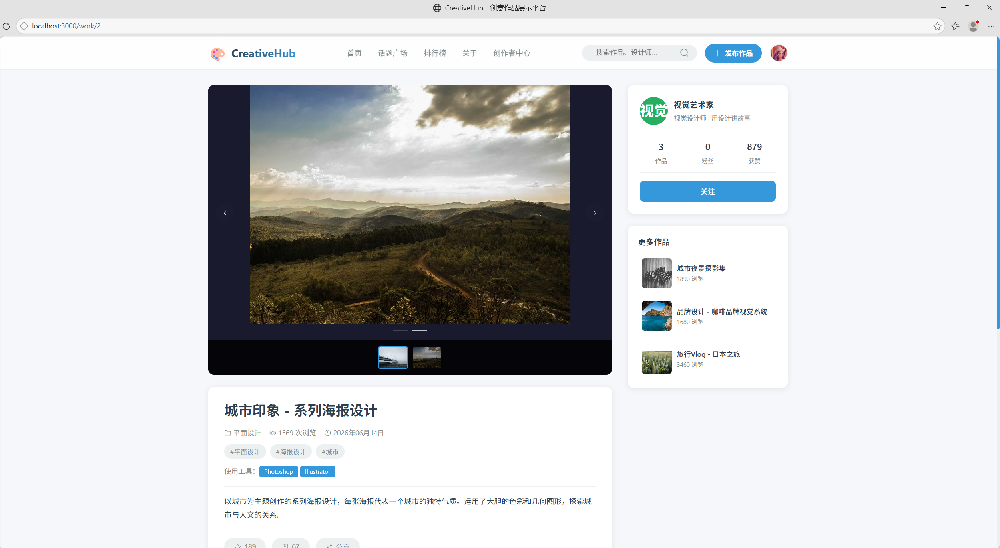

#### 4. 全屏查看

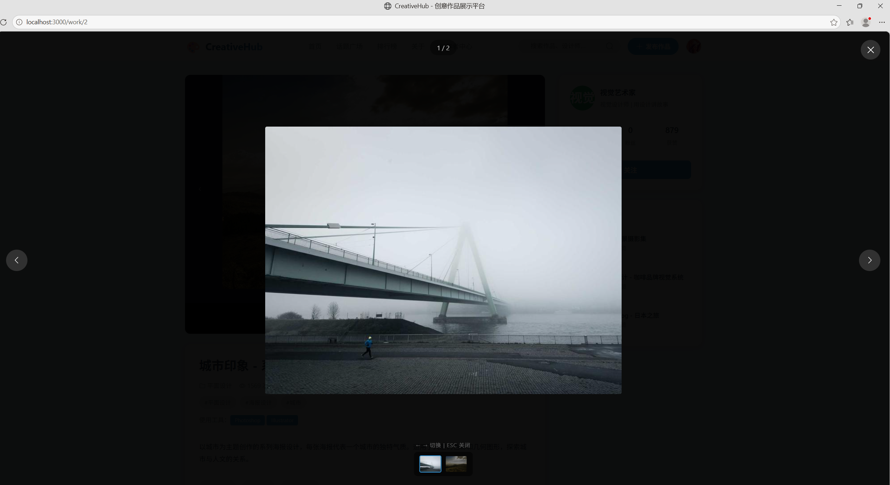

#### 5. 个人主页

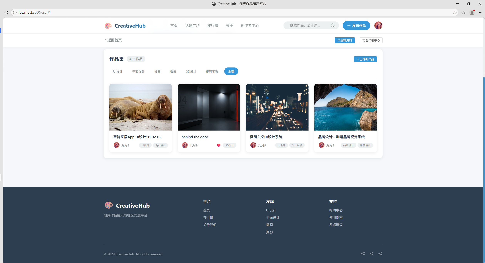

#### 6. 话题广场

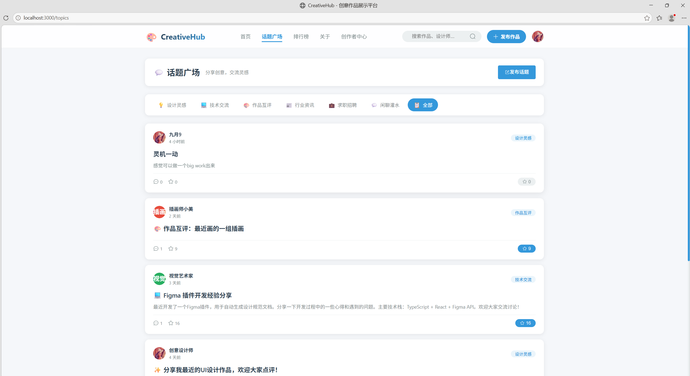

#### 7. 话题详情

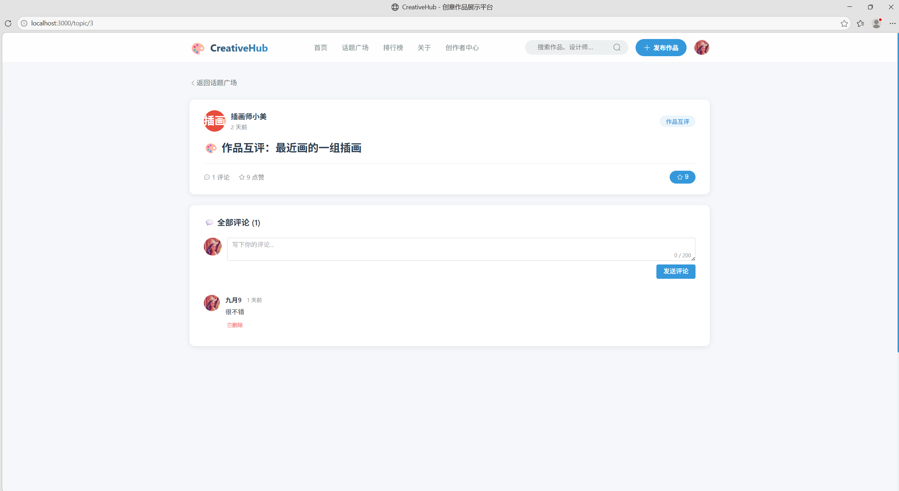

#### 8. 作品排行榜+投票结果展示

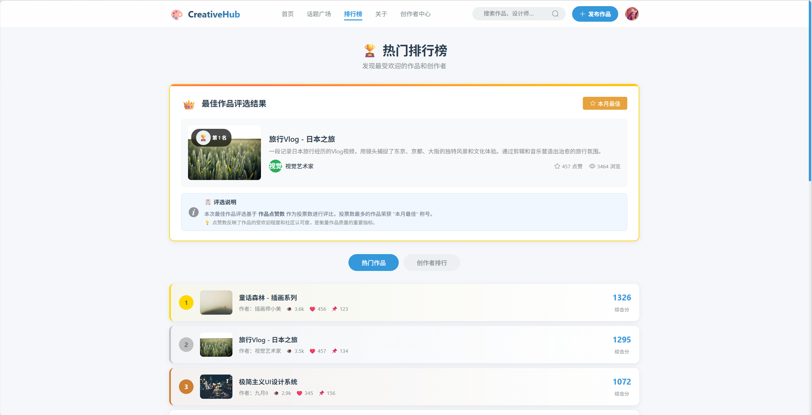

#### 9. 创作者排行榜

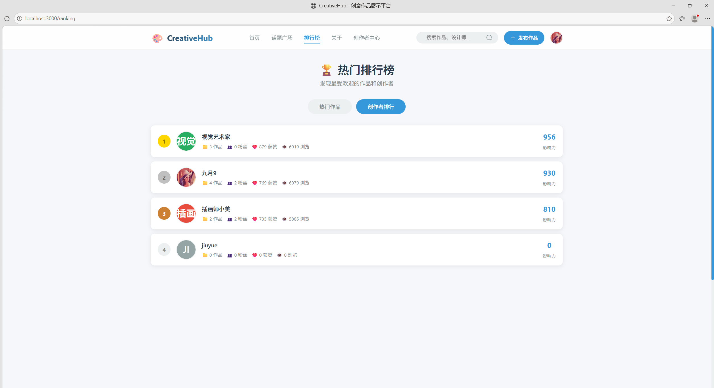

#### 10. 搜索页面

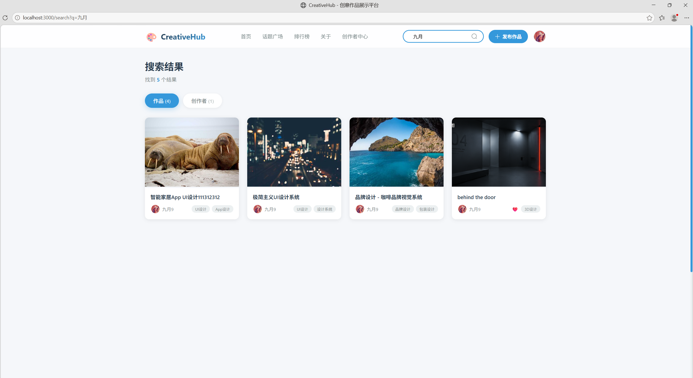

#### 11. 登录页面

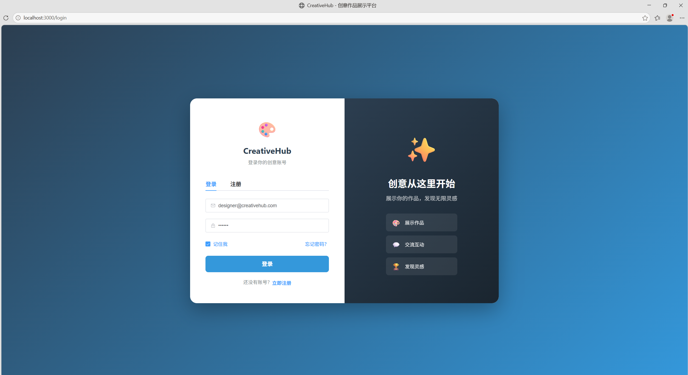

#### 12. 仪表盘

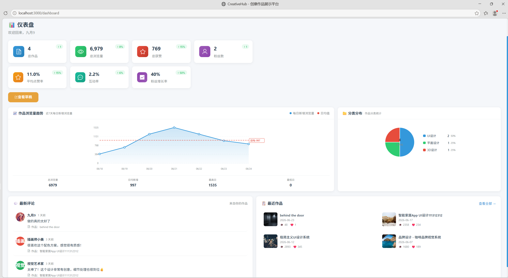

#### 13. 作品管理

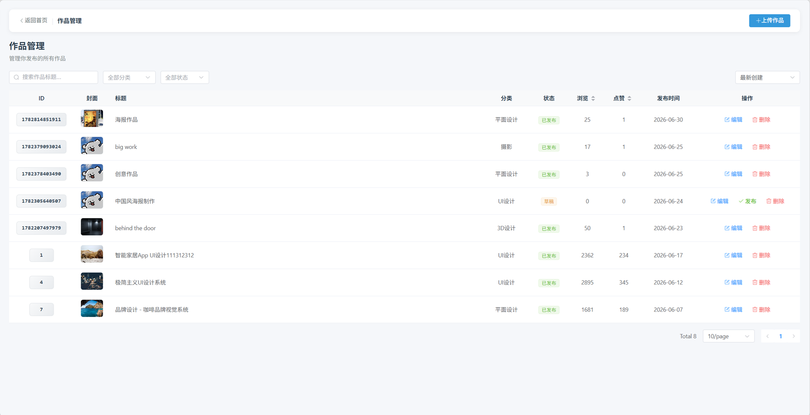

#### 14. 上传作品

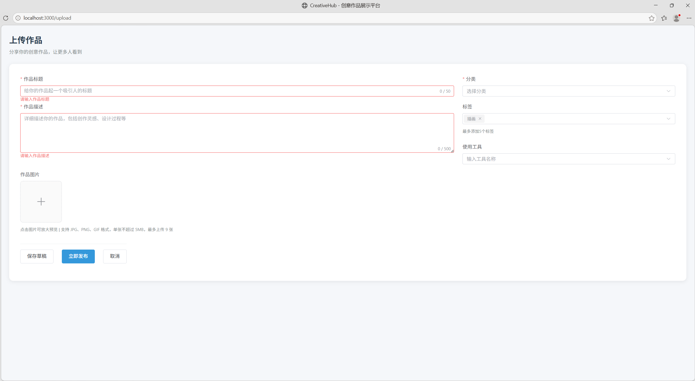

#### 15. 草稿箱

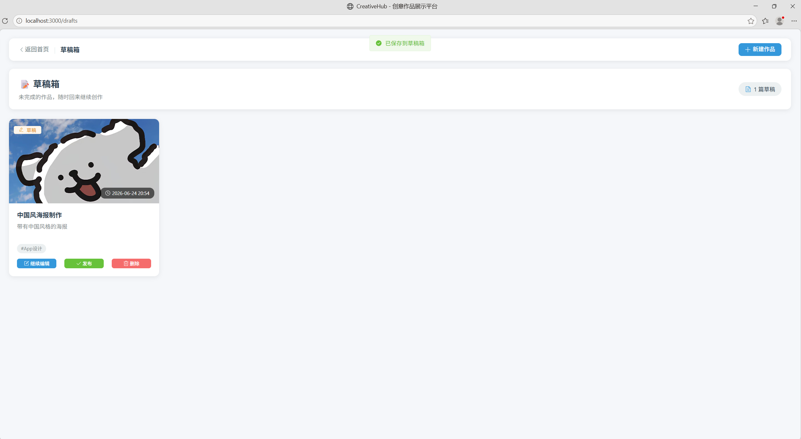

#### 16. 个人设置

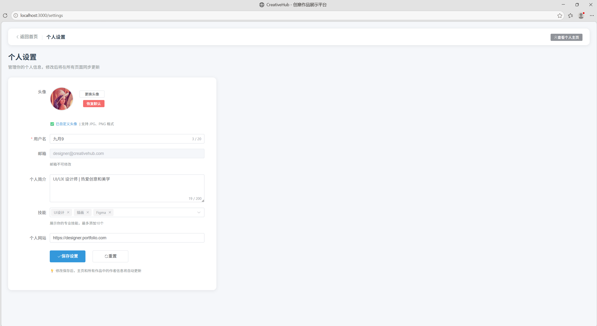

#### 17. 我的收藏

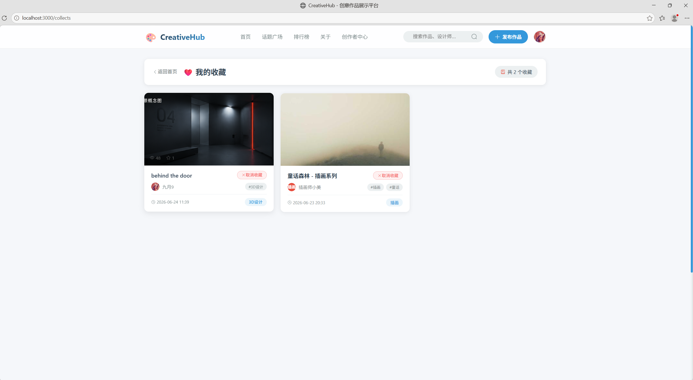

#### 18. 关注管理 - 我的关注

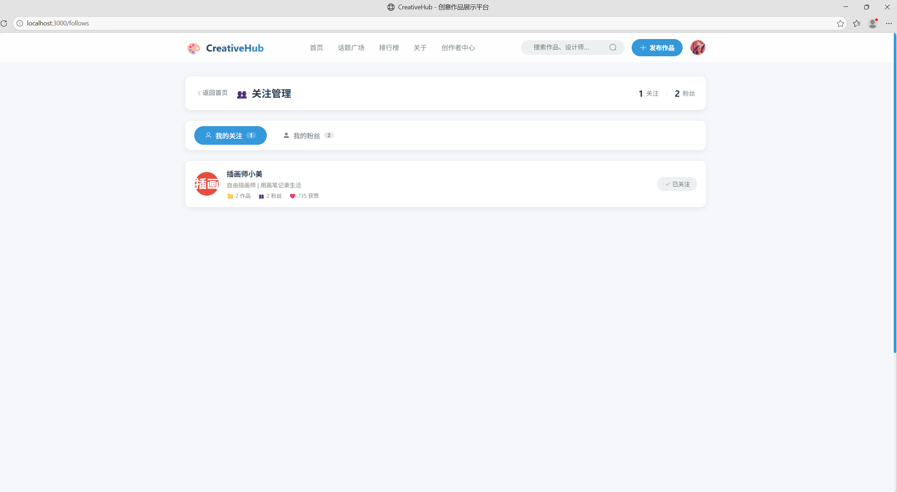

#### 19. 关注管理 - 我的粉丝

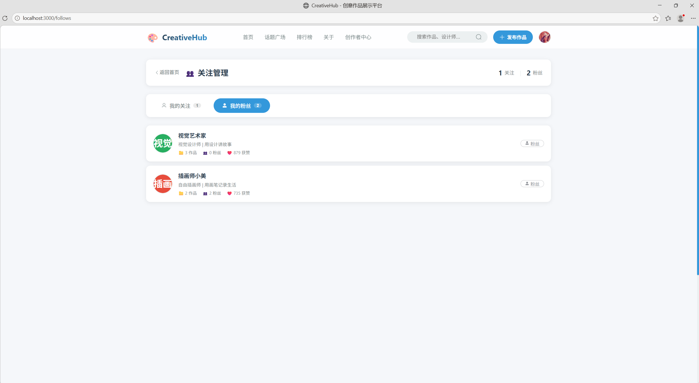

🌐 在线演示地址
Creativehub网站的核心功能演示视频已经录制完毕并上传小雅

🧪 测试账号
用户名 邮箱 密码 角色
九月9 designer@creativehub.com 123456 管理员
视觉艺术家 artist@creativehub.com 123456 创作者
插画师小美 xiaomei@creativehub.com 123456 创作者
